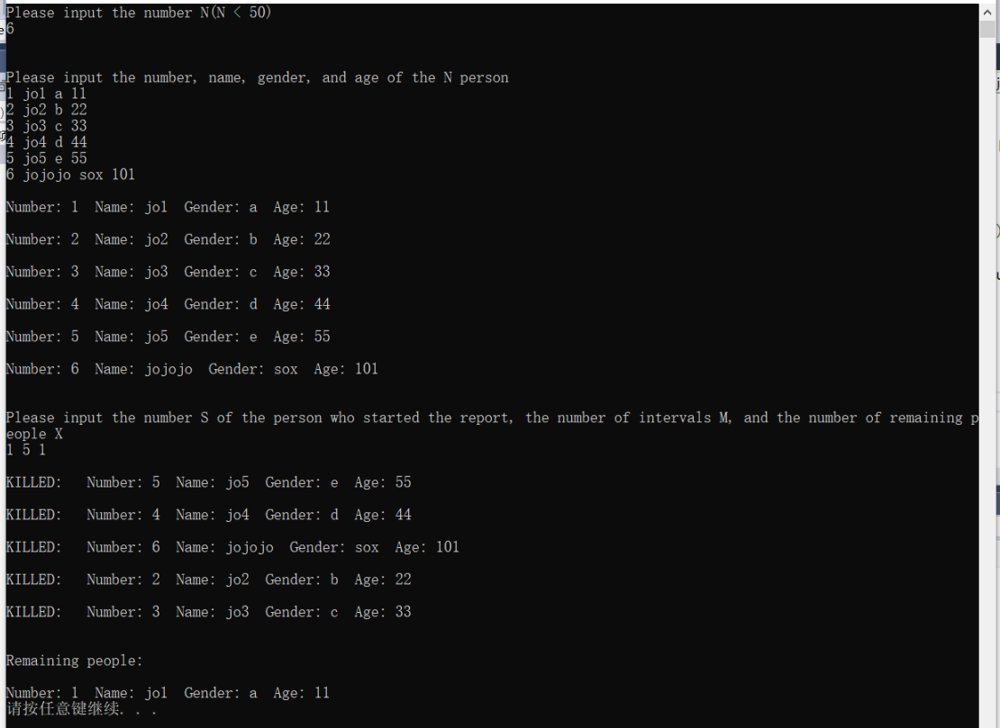

# 设计报告

author dachr

author 张志博 2017211416 

## 设计思路

数据结构：循环链表

程序流程：先在主程序中初始化循环链表，然后打印用户输入提示，读取用户的输入，调用对应的函数，实现对应的功能，输出对应的结果。
调用关系：主函数调用其他程序模块。

## 代码说明

1. 结构体定义

```c
// Circular linked list storage structure
typedef struct INFO {
	int number;
	char name[20];
	char gender[10];
	int age;
}info;

typedef info elemType;
typedef struct CLNode {
	elemType data;       // Node data field
	struct CLNode *next; // Node pointer field
}CLNode, *CLinkList;     // Circular Linked List is a pointer type to the structure CLNode
```

1. 函数及其功能

```c
// Construct an empty circular linked list L
bool initCircLinkList(CLinkList *L);

// Enter the value of n elements in positive order to create a circular linked list L with a head node
void createCircLinkList(CLinkList *L, int n);

// The value of the element is obtained from the circular link list L with the head node according to the sequence number i, and the value of the i-th data element in the L is returned by e.
bool getElem(CLinkList L, int i, elemType *e);

// In the circular linked list L with the head node, delete the first element with the number
bool listDelete(CLinkList *L, int number);

// Find the node numbered S in the circular linked list
// Count back from 1 and delete the person (node) from M from the circular list and output the person's number
// Repeat the steps from the next person who was just deleted, until only X people remain in the end
bool josephus(CLinkList *L, int *n, int s, int m, int x);
```

## 运行结果截图


