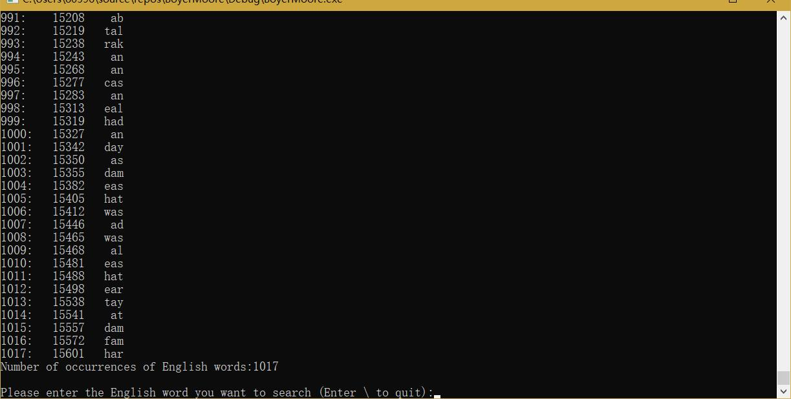

# 设计报告

author dachr

author 张志博 2017211416 

## 设计思路

- 实验要求：

>1.任选一篇txt格式的英文文档；

>2.用户输入任意一个英文单词，可以在该英文文档中检索这个英文单词，如果找到，则给出该英文单词出现的次数和所有位置，如果没有找到返回检索失败；

>3.用户输入可以用命令行方式，所选的英文文档路径也用命令行输入；

>4.采用BM算法进行检索（Boyer - Moore算法是一种基于后缀匹配的模式串匹配算法，后缀匹配就是模式串从右到左开始比较，但模式串的移动还是从左到右的。）；

>5.需要提交设计报告和源代码，要求和《实验一》一样

>补充：输入的单词中包括通配字符；


- 数据结构：串的堆式顺序存储结构（变长结构体，对于文本串）、串的定长顺序存储结构（对于模式串）

- 程序流程：

1. 首先，提示用户输入一篇txt格式的英文文档的文件路径，如果打开文件成功则遍历两次文件流，第一次记录文章的长度/文件的大小，之后据此申请存储文章信息的变长结构体的内存；

2. 然后，提示用户输入任意一个英文单词，并用支持通配字符‘？’的BM算法在该英文文档中检索这个英文单词，如果找到，则打印该英文单词及其出现的次数和所有位置，如果没有找到则打印其出现的次数为0；

3. 最后，每一次检索结束，之前读取的模式串会被系统释放， 并进入while循环，读取新的模式串，只有输入为‘\’时才会使continue_flag变为false，并使循环结束，释放之前申请的变长结构体的内存。

4. 关于错误的处理：任意的输入错误、内存分配错误都会使程序直接结束。

5. 关于通配字符‘？’的BM适配：通过修改原BM算法中生成Bad Character数组的函数，使对于模式串中不存在的字符，将“遇见不匹配时，直接移动模式串的长度”的情况改为“遇见不匹配时，直接移动模式串中最右侧的‘?’距离字符串尾部的长度”，对于模式串中存在的字符，将“遇见不匹配时，直接移动模式串最右侧的该字符距离字符串尾部的长度”改为“遇见不匹配时，直接移动模式串最右侧的该字符距离字符串尾部和最右侧的‘?’距离字符串尾部的长度中较小的长度”；再将生成Good Suffix数组的函数和BM的控制函数中判断“两字符相等”的条件改为判断“两字符相等或者比较的模式串字符为‘？’”。

- 调用关系：

0. 源代码由3个文件组成：main.c BoyerMoore.c BoyerMoore.h；

1. main.c模块中的main函数调用BoyerMoore.c模块中的keywordSearch_BM函数；

2. BoyerMoore.c模块中的keywordSearch_BM函数调用BoyerMoore.c中的静态函数preBmBc和preBmGs；

3. BoyerMoore.c模块中的preBmGs函数调用BoyerMoore.c中的静态函数suffix函数。

## 代码说明

1. 结构体定义

```c
#define ASIZE 128 // ASCII
#define PATTERN_LEN 99

// String heap sequential storage structure
typedef struct {
	int length;   // Current length of the string
	char ch[0];   // If it is a non - empty string, the storage area is allocated according to the length of the string, otherwise ch is NULL.
}TString;

// String fixed length storage structure
typedef struct {
	int length;             // Current length of the string
	char ch[PATTERN_LEN];   // One-dimensional array of storage strings
}SString;
```

2. 函数及其功能

BoyerMoore.h
```c
// Parameter: text(English document)
// First, read an English word that the user wants to retrieve.
// Then, retrieve the English word in the English document, and output the number of occurrences and all positions of the English word.
// Return false if the English word is empty, otherwise return true.
// Added: wildcard characters are included in the input words
bool keywordSearch_BM(TString *text, SString pattern);
```

BoyerMoore.c
```c
// The Bad Character Rule
static void preBmBc(SString patt, int* bmBc);


// Calculate the maximum length that matches the pattern string suffix with i as the boundary (the concept of the interval)
static void suffix(SString str, int *suff);


// Preprocessing of good suffix algorithm
/*
There are three situations
1. There are substrings in the pattern string that match the good suffix
2. No substring matches the good suffix in the pattern string, but finds a maximum prefix.
3. No substring matches the good suffix in the pattern string, but no maximum prefix can be found.

Comparison of bmGs[i] values obtained in 3 cases:
3 > 2 > 1
In order to ensure that its value is getting smaller and smaller
So deal with 3->2->1 cases in order
 */
static bool preBmGs(SString patt, int* bmGs);
```


## 运行结果截图

程序运行截图1（开始界面）


程序运行截图2（支持含通配字符‘?’的搜索）


程序运行截图3（搜索”was“）


程序运行截图4（搜索”wa?“）


程序运行截图5（搜索”w?s“）


程序运行截图5（搜索”?as“）


程序运行截图5（搜索”?a?“）
