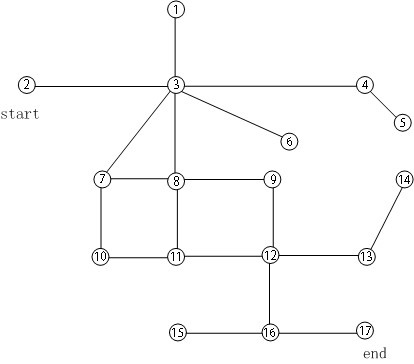
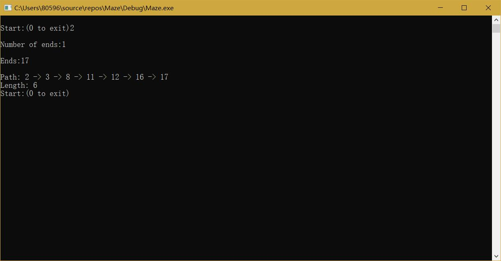
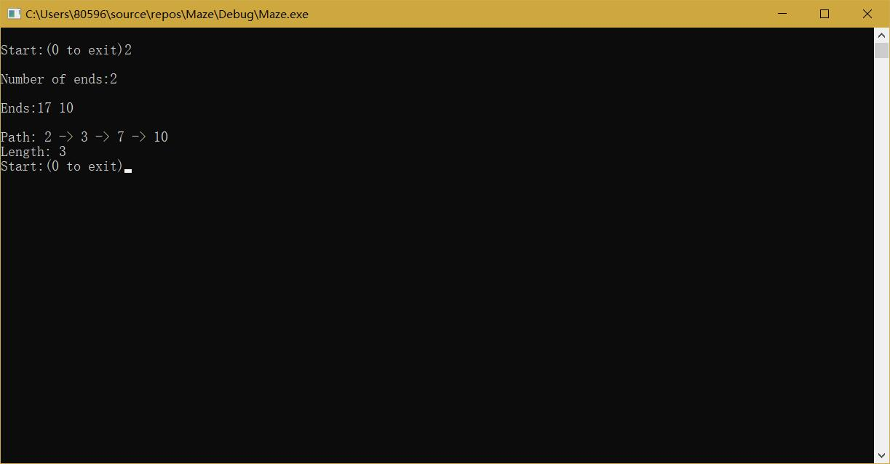

# 设计报告

author dachr

author 张志博 2017211416 

## 设计思路

- 实验要求：

>1.从开始位置（start）找出到出口（end）的通路，并从start到end输出；输出路径的长度。

>2.采用下图迷宫

>3.可以将节点进行编号，从1开始编号，编号次序从上到下，从左到右；保存每条边，根据两个节点之间是否有边，来决定是否能够走通；

>4.将边保存在文件中，用俩个端点来表示一条边；

>5.每个节点的分支数不一样，要求根据分支数决定遍历的方向数，不能用恒定的遍历方向数。

>6.需要提交设计报告和源代码，要求和《实验一》一样

>补充：找到从start到end的一条最短的路径；当迷宫有多个出口应该如何找到最近的出口；


- 数据结构：采用邻接表表示法创建的无向图（ALG，UDG）

- 程序流程：

1. 首先，在主程序中通过重定向标准输入流，以读取含有迷宫信息的文件“maze.txt”，根据信息创建采用邻接表表示法创建的无向图。

2. 之后，提示用户输入信息，读取出发节点start，目的地结点的数量endNum，以及包含所有目的地结点的数组end。

3. 最后，核心算法通过DFS遍历设置各个结点与start结点间的最短相对距离（根据补充要求1），存储于length数组，再根据length在目的地结点end们中寻找到与maze距离最近的nearestEnd（根据补充要求2），并通过一个循环找到一条从nearestEnd返回start的路径，之后逆序输出这条路经，即打印出了所需的结果。

4. 之后再次提示用户输入信息，可以根据提示输入来退出问答循环并结束程序。

5. 关于错误的处理：任意的输入错误、内存分配错误都会使程序直接结束。

- 调用关系：

1. main.c模块中的main函数调用maze.c模块中的createUDG、printShortestPath函数;

2. maze.c模块中的printShortestPath函数调用maze.c中的静态函数getPath_DFS。

## 代码说明

1. 结构体定义

```c
// Graph adjacency table storage representation
#define MVNum 20                // Maximum vertex number

typedef struct ArcNode {
	//Side node
	int adjVex;                 // The position of the vertex pointed to by the side
	struct ArcNode *nextArc;    // Pointer to the next side
}ArcNode;

typedef struct {
	//Vertex information
	ArcNode *firstArc;          // Pointer to a side attached to the vertex
}VNode, AdjList[MVNum];         // AdjList indicates the adjacency table type

typedef struct {
	AdjList vertices;
	int vexnum, arcnum;         // The current number of vertices and sides of the graph
}ALGraph;
```

2. 函数及其功能

```c
// Create an undirected graph G using the adjacency table notation
bool createUDG(ALGraph *G);

// Find the path to the exit from the start position and output it from start to end; output the length of the path
bool printShortestPath(ALGraph G, int start, int *end, int endNum);

// Use the DFS algorithm to find the shortest relative distance between the destination point and the starting point, stored in the length array.
static void getPath_DFS(ALGraph G, int currentVex, int length[]);
```

## 运行结果截图



满足补充要求1：找到从start到end的一条最短的路径


满足补充要求2：当迷宫有多个出口应该如何找到最近的出口

