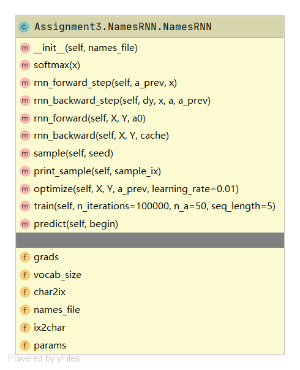
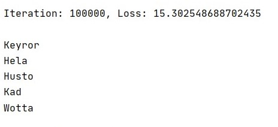
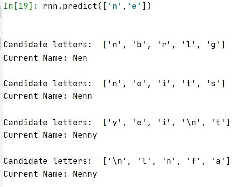

# 题目6实验报告
## 任务定义
> #### 题目 6：采用 RNN 为小 Baby 起个英文名字吧(20 points)
>- 本作业提供了8000多个英文名字，试训练一个环神经网络语言模型，进而给定若干个开始字母，由语言模型自动生成后续的字母，直到生成一个名字的结束符。
>- 从模型生成的名字中，挑选你最喜欢的一个，并采用一种可视化技术，绘制出模型为每个时刻预测的前5个最可能的候选字母。

## 输入输出
- 输入：若干作为名字开头的字母。
- 输出：以输入字母为开头的英文名。

## 方法描述

### 为什么用RNN
- 首先，在这里先简要解释一下我对RNN的理解。
RNN背后的思想是它可以处理顺序信息，这意味着只要输入，它就可以生成序列的下一个元素。
为此，RNN需要学习序列的模式。
因此，在这种情况下，我们可以在婴儿名字数据集上训练网络。

### 训练
- 由于名称不是很长的顺序。
我使用了字符级语言模型，给定一个字符将根据模型指定的概率分布生成下一个字符，如下图所示。

### 代码
- 代码有英文注释，依赖库只有numpy，在此不再赘述

## 结果分析
- 经过训练然后采样以生成下一个字符，下面是以全部接近8000个英文名字作为训练集，使用了50个RNN单元迭代100000次的结果。

- 在最初的迭代中，模型只是生成了没有意义的字符。
但是经过成千上万次迭代之后，可以看到一些尝试生成名字的尝试，但是仍然有些不常见的字母组合。
在耐心等待之后，几分钟后，我们可以看到生成的名称现在更真实了。
但是，对于很多字母组合开头的名字，模型仍不能给出很足够多合适的名字，可以看出仍有改进的空间，比如通过增加训练集或更仔细地调整模型的参数的方式。
- 尽管该模型生成的名字听起来可能很奇怪，但他们的确都很酷，例如上图中的Mevnor，Kyrssa和Worrel，有些名字已经有人使用过了，有些还没有，也许随着时代的变迁和文化的发展，将来可能会有人取类似的名字。
- 在性能方面，取名的评价指标可能是这个名字的出现频率，但是过于常见的名字显然不是一个好的选择，但是过于不常见的名字几乎一定不是一个好的选择，难以轻易评估，故这里就没有进行过于深入的评价。
此外，从速度的角度来说的话，RNN可以训练快速，生成逻辑有解释性，使用时也不需要花费任何时间。

### 任务实现
- 我最喜欢的生成的名字：Nenny
- 每个时刻预测的前5个最可能的候选字母：

## 编程和实验的软硬件环境
- 软件
    - OS：Windows 10
    - IDE：Pycharm Professional 2020.1.1
    - Interpreter：Python 3.7
- 硬件
    - CPU：Intel(R) Core(TM) i7-9750H CPU @ 2.60GHz